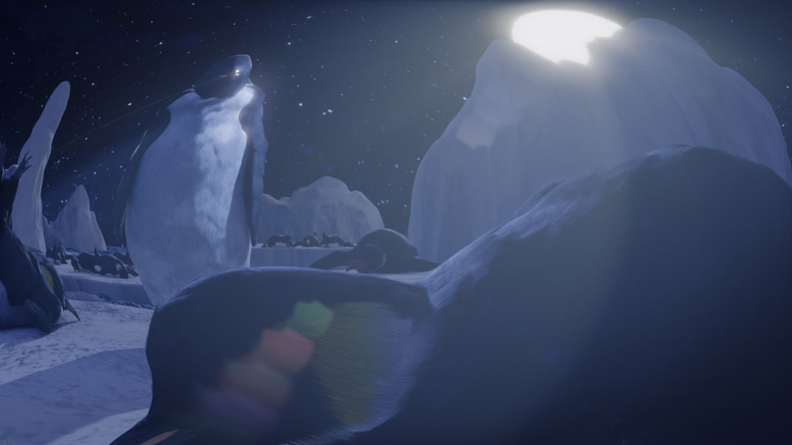
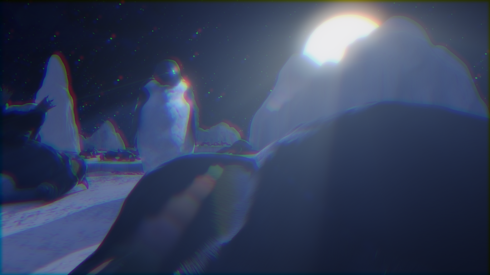
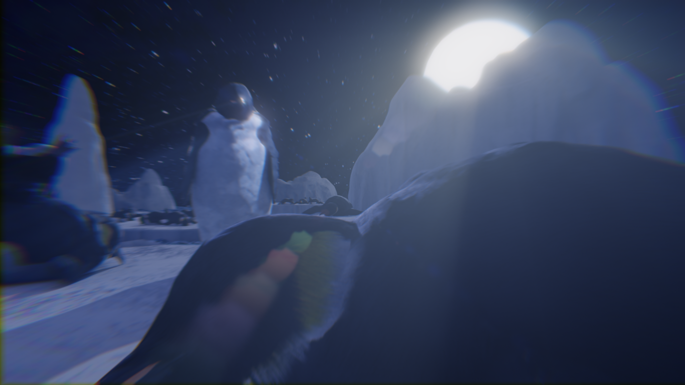
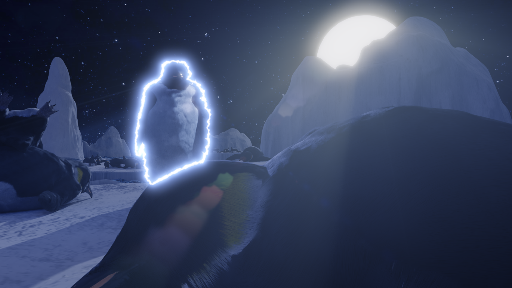
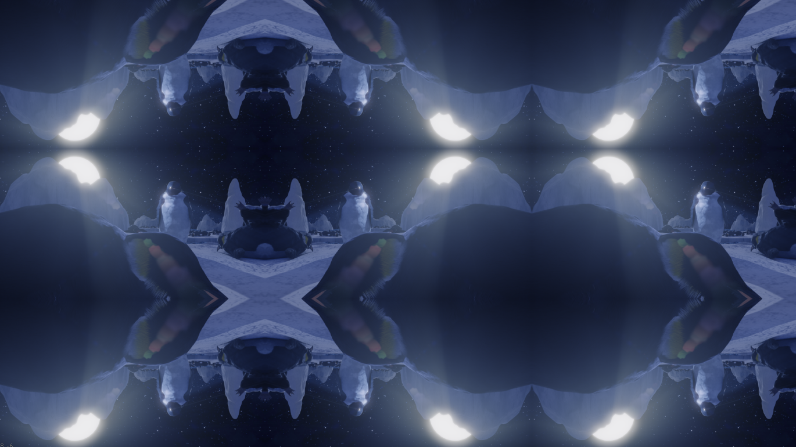

# Nuke-Gizmos

# Effects

## Blob
Command: `blob`  
Dependency: None

### Parameters
**BLOB**: The "blobness"

## Chromatic Aberration
Command: `chromaa`  
Dependency: None

### Parameters
**translateRED**: Position offset of the red channel 
**scaleRED**: Scale of the red channel 
**translateGREEN**: Position offset of the green channel 
**scaleGREEN**: Scale of the green channel 
**translateBLUE**: Position offset of the blue channel 
**scaleBLUE**: Scale of the blue channel 
**blu**r: Blurness of the red and blue channels

## Dispersion
Command: `disperse`  
Dependency: None

### Parameters
**blob**: Intensity of the chromatic aberration 
**R blob**: Additional multiplier for the aberration of the red channel 
**G blob**: Additional multiplier for the aberration of the green channel 
**B blob**: Additional multiplier for the aberration of the blue channel 
**ray**: Amount of blurring between each aberrated channels 
**R ray**: Additional blurring on the red channel 
**G ray**: Additional blurring on the green channel 
**B ray**: Additional blurring on the blue channel 
**blur**: Blurness of the red and blue channels 
**blend**: Blending factor. Used with the `blend with` parameter 
**blend with**: 
chroma - Blend with the aberrated source 
source - Blend with the original unaberrated source

## Edge Glow
Command: `edgeg`  
Dependency: None

### Parameters
**width**: Thickness of the Edge Glow 
**tint**: Color of the Edge Glow 
**amplitude**: Intensity of the distortion 
**scale**: Size of wrinkles on the Edge Glow 
**edge blur**: Blurring of the Edge Glow 
**small glow**: Radius of small bloom 
**large glow**: Radius of large bloom 
**speed**: Speed of distortion

## Mirror Wrapping
Command: `wrap`  
Dependency: None

### Parameters
(Same as the Transform node)
**translate**: Position offset 
**rotate**: Orientation 
**scale**: Size of output relative to the source 
**motionblur**: Amount of motion blur 
**shutter**: Amount of frame being considered in motion blur

# Transitions

## Spin
Command: `tspin`  
Dependency: None

### Parameters
**transit**: Animate this parameter to create transition 
**curvature**: Rate of change of the rotating speed. Affect the middle part of the transition more when compared with `slope` 
**slope**: Rate of change of the rotating speed. Affect the start and end parts of the transition more when compared with `curvature` 
**motionblur**: Amount of motion blur 
**shutter**: Amount of frame being considered in motion blur

## Shake
Command: `tshake`  
Dependency: None

### Parameters
**transit**: Animate this parameter to create transition 
**amplitude**: Shaking amplitude 
**frequency**: Shaking frequency (speed of shaking) 
**phase**: Random seed of the random shaking 
**decay**: The decaying rate of the amplitude 
**motionblur**: Amount of motion blur 
**shutter**: Amount of frame being considered in motion blur

## S-Zoom
Command: `tszoom`  
Dependency: Dispersion, Mirror Wrapping

### Parameters
**transit**: Animate this parameter to create transition 
**motionblur**: Amount of motion blur 
**shutter**: Amount of frame being considered in motion blur 
**blob**: Maximum "blobness" 
**rotate**: Maximum rotation 
**scale**: Maximum scaling 
**curvature**: Rate of change of the quantity. Affect the middle part of the transition more when compared with `slope` 
**slope**: Rate of change of the quantity. Affect the start and end parts of the transition more when compared with `curvature` 
**frequency**: Shaking frequency (speed of shaking) 
**amplitude**: Shaking amplitude 
**decay**: The decaying rate of the amplitude 
**disperse**: Maximum "blobness" (rgb channels all blob in different direction) 
**ray**: Maximum blurring between each aberrated channels

## General Transition Node
Command: `gtn`  
Dependency: Spin, Shake, S-Zoom
### Parameters
**transit**: Animate this parameter to create transition 
**motionblur**: Amount of motion blur 
**shutter**: Amount of frame being considered in motion blur 
**curvature**: Rate of change of the quantity. Affect the middle part of the transition more when compared with `slope` 
**slope**: Rate of change of the quantity. Affect the start and end parts of the transition more when compared with `curvature` 
**transition**: The transition to be used 
**symmetric**: Can be used to create custom transitions outside this node. Symmetric means it goes from 0 to 1 then back to 0 
**asymmetric**: Can be used to create custom transitions outside this node. Asymmetric means it only goes from 0 to 1
